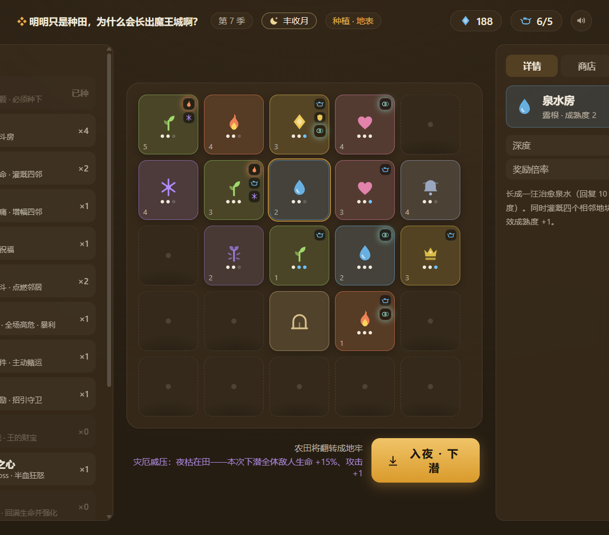
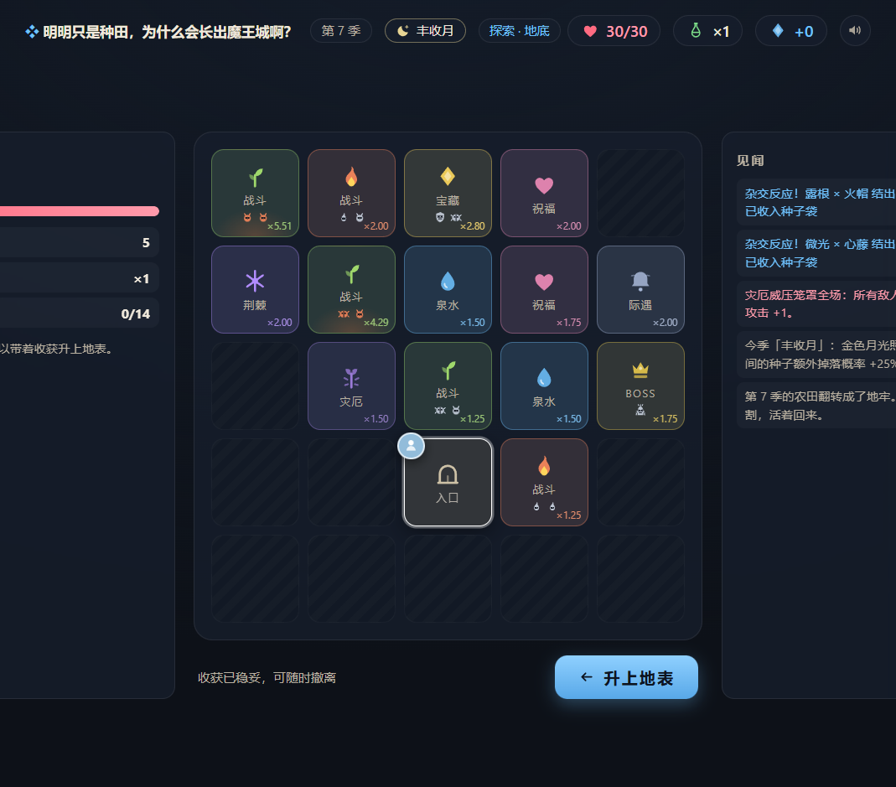
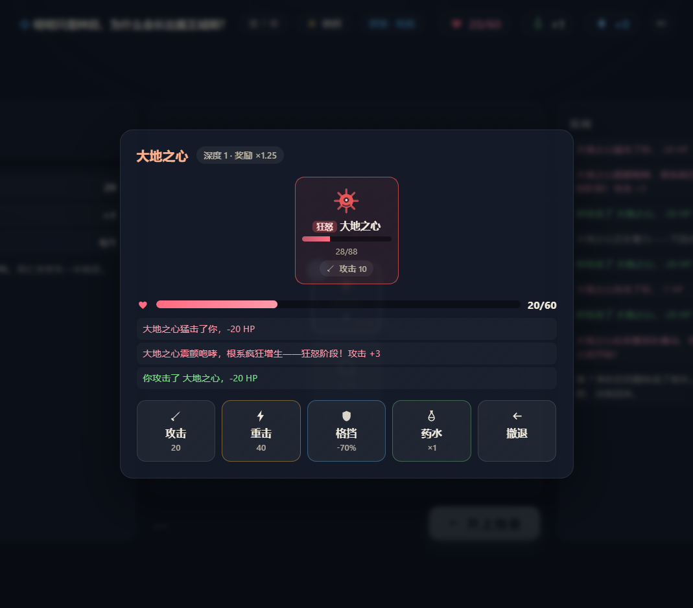

# 明明只是种田，为什么会长出魔王城啊？

<p>
  
  
  
  
  
</p>

**Seed the Dungeon** — 一个「农田即地牢」的浏览器 roguelike 原型。
你白天在地表种田，入夜后整片农田**原位翻转**成地下城：种了的格子长成房间，空着的格子凝成岩壁。种瓜得瓜，种豆得豆，种王种得魔王。

> **种田阶段 = 编辑下一局冒险的规则；冒险阶段 = 验证这次构筑并收获新种子。**



| 探索地底 | 终局 Boss · 狂怒阶段 | 通关结算 |
| :-: | :-: | :-: |
|  |  |  |

## 快速开始

```bash
npm install
npm run dev        # 开发服务器（默认 http://localhost:5173）
npm run build      # 生产构建
```

纯前端，无后端依赖。存档自动写入 localStorage，刷新即恢复，旧版本存档自动迁移。

## 30 秒上手

1. **种**：把门种（入口）和作物种进 5×5 农田。不种的格子就是墙——用墙塑形走廊，也是一种种植。
2. **浇**：水有限。成熟度同时拉高房间的奖励**和**敌人强度。
3. **翻**：点「入夜 · 下潜」，农田原位翻转成地牢。离门越远的房间，奖励倍率越高。
4. **割**：逐房探索（轻量回合制：攻击 / 重击 / 格挡 / 药水 / 撤退，敌人意图全公开）。回到入口撤离保全收获；全清拿完美奖励；死亡丢一半。
5. **再来**：带回的种子比商店货更高级——「种 A 收 B」驱动构筑进化，下一季种出更深、更险、更富的地牢。

## 系统一览

### 种子图鉴（14 种）

| 种子 | 稀有度 | 长成 | 效果 |
| --- | --- | --- | --- |
| 门种 | — | 入口 | 每季免费一颗，必须种下，地牢唯一入口 |
| 铜芽 | 普通 | 铜芽巢室 | 基础战斗房，掉精华与普通种子 |
| 露根 | 普通 | 泉水房 | 治疗泉水；同时**灌溉四邻**（有效成熟度 +1） |
| 荆棘 | 普通 | 荆棘廊 | 穿行刺痛；**增幅四邻**奖励（每丛 +40%） |
| 心藤 | 罕见 | 心藤龛 | 三选一祝福（力量 / 树皮 / 吸血……） |
| 火帽 | 罕见 | 火帽窟 | 高危战斗；**点燃相邻铜芽**：敌人更凶，掉落 ×1.75 |
| 雾铃 | 罕见 | 迷雾铃堂 | 5 种二选一随机际遇（投井 / 献血 / 古碑 / 幽灵商人 / 塌方） |
| 微光 | 稀有 | 微光宝库 | 丰厚奖励；相邻战斗房会**招来守卫**（需战斗，×1.6） |
| 王种 | 稀有 | 王座窟 | 根须霸主 Boss：固定循环 + 召唤芽虫护驾 |
| **夜枯** | 诅咒 | 灾厄窟 | 种下即全局开**灾厄威压**（敌人生命 ×1.15、攻击 +1）；踏入受重伤但暴利 |
| **大地之心** | 传说 | 大地之心 | 终局两阶段 Boss，击败即通关（里程碑解锁） |
| 蒸露 | 杂交 | 蒸汽温泉 | 回满生命并攻击 +1（露根 × 火帽） |
| 铁棘 | 杂交 | 精英巢室 | 铁壳卫驻守，精华丰厚、可掉王种（铜芽 × 荆棘） |
| 辉心 | 杂交 | 辉光圣龛 | 强化版三选一祝福（微光 × 心藤） |

杂交：相邻且双方有效成熟度满级的特定组合，在下潜瞬间各结出 1 颗杂交种子，种植界面有实时预览角标。

### 季节天气（每季一条全局规则）

| 天气 | 效果 |
| --- | --- |
| 晴朗 | 基准，无修正（第 1 季固定） |
| 甘霖 | 开局水 +2（可超上限） |
| 旱光 | 开局水 −1，但所有房间精华 ×1.2 |
| 雾月 | 奖励倍率 +0.15，但敌人攻击 +1 |
| 寒潮 | 敌人生命 ×0.85，但泉水治疗 −4 |
| 丰收月 | 种子额外掉落概率 +25% |

天气与威压在下潜瞬间**烘焙进房间数据**，潜入中不再变化；HUD 常驻天气徽章，种植预览的所有数值实时含修正。

### 终局 · 大地之心

达成「屠王者」+「初次杂交」后商店解锁（50 精华）。88 HP / 7 攻击，生命过半进入**狂怒**：攻击 +3，意图循环从「攻击 → 蓄力 → 猛击 → 召唤」切为「攻击 → 召唤 → 猛击」。击败后进入金色通关结算与无尽模式。

### 经营与成长

精华用于：解锁地块（至 5×5）、购买种子、升级水壶与药水袋、四座一次性永久建筑（温室 / 晒谷场 / 药圃 / 瞭望塔）。11 个里程碑提供引导与一次性奖励。

## 设计原则

- **所见即所得**：邻接效应、杂交预备、天气修正、灾厄威压——一切规则在种植期可见、可预览，下潜只是验证你的设计。
- **极简无素材**：美术为纯 SVG 几何图标 + CSS 变量双主题（地表暖 ↔ 地底冷）；约 20 个音效全部由 Web Audio 振荡器 + 噪声包络实时合成，仓库里没有一张图片、一个音频文件。
- **不是缝合**：种田不产作物，产规则。农田的空间布局直接就是地牢的拓扑结构。

## 技术

- Vite + React 19 + TypeScript（strict）
- zustand + immer（状态管理与 localStorage 持久化，含跨版本存档迁移）
- framer-motion（翻转入场 / 战斗反馈动画）

```
src/
  game/        纯逻辑（无 UI 依赖）：种子表、邻接效应、天气、地牢生成、
               战斗、掉落、事件、里程碑、音效合成、zustand store
  components/  视图：FarmView / DungeonView / CombatPanel / ResultView / HUD / icons
docs/          README 截图
```

## 路线图

- [x] **第一阶段**：核心循环（种植 → 翻转 → 探索 → 结算）、邻接效应实时预览、回合战斗、商店与里程碑、自动存档
- [x] **第二阶段**：杂交种子、雾铃事件房、王种 Boss（召唤机制）、农场永久建筑、存档迁移
- [x] **第三阶段**：季节天气、夜枯诅咒种（全局威压高危模式）、终局 Boss「大地之心」与通关、Web Audio 合成音效
- [ ] 可能的未来：种子词缀 / 地牢谜题房 / 每日挑战种子包 / 移动端适配

## License

[MIT](LICENSE)
