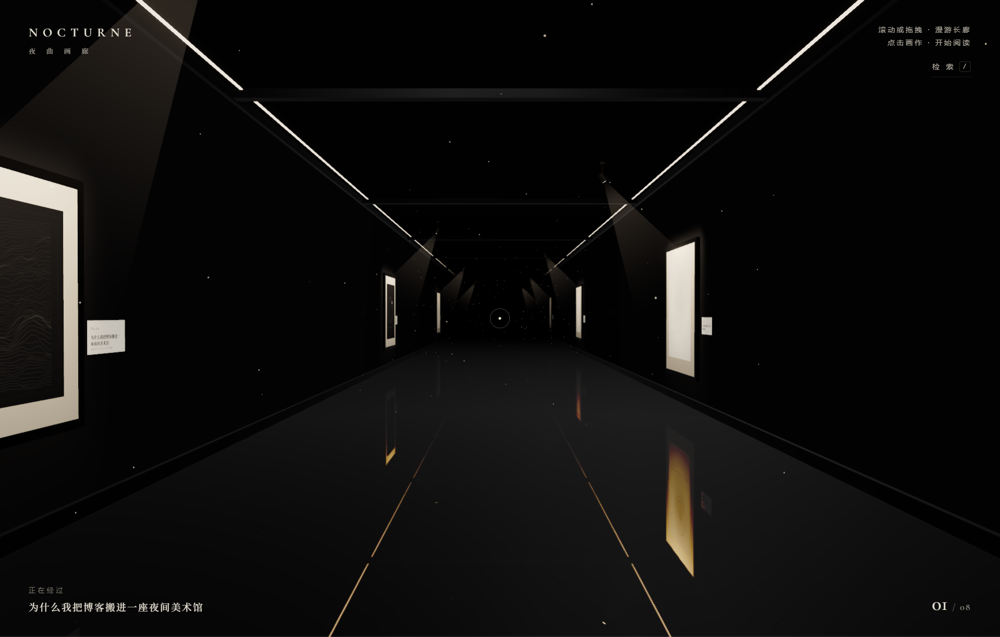
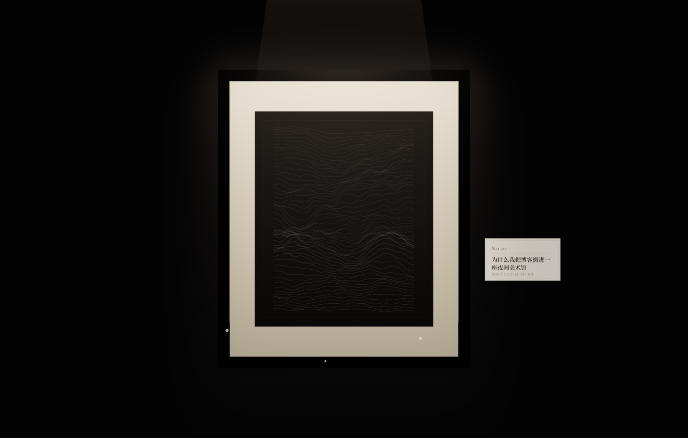
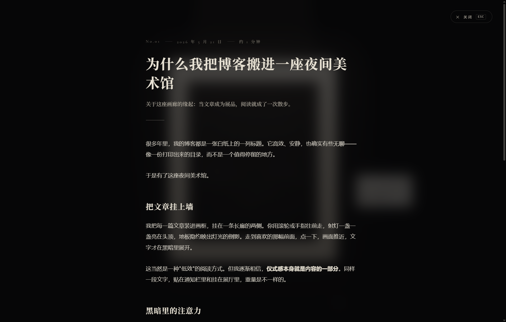
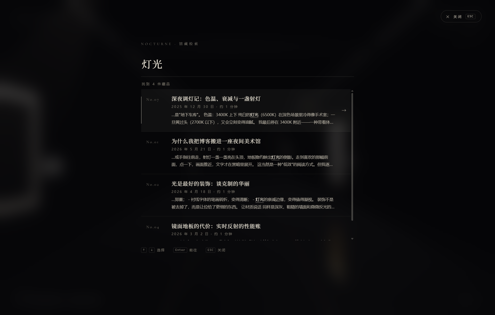

# NOCTURNE · 夜曲画廊

<p>
  
  
  
  
</p>

**NOCTURNE** 是一座开在浏览器里的夜间美术馆，也是一个博客。

文章不再是列表里的一行标题，而是装进画框、挂在深色长廊两侧的展品：
滚轮往前走，射灯一盏一盏亮在头顶，镜面地板映出灯光的倒影；
走到喜欢的那幅前面点一下，画面推近，文字才在黑暗里展开。



| 聚焦一幅画 | 阅读层 | 馆藏检索 |
| :-: | :-: | :-: |
|  |  |  |

## 快速开始

```bash
npm install
npm run dev      # 本地开发（默认 http://localhost:5173）
npm run build    # 类型检查 + 产物构建
npm run preview  # 预览构建产物
```

纯前端项目，没有后端、没有数据库，构建产物可以部署到任何静态托管。

## 操作方式

| 操作 | 效果 |
| --- | --- |
| 滚轮 / 拖拽 / `W` `S` `↑` `↓` | 沿长廊前进、后退 |
| `PageUp` / `PageDown` | 跳到上一幅 / 下一幅画作 |
| 点击画作 / `Enter` | 推近聚焦并打开文章 |
| `/` 或 `Ctrl+K` / 右上「检索」 | 打开馆藏检索，`↑` `↓` 选择、`Enter` 前往 |
| `ESC` / 关闭按钮 / 点击背景 | 退出阅读，返回长廊 |

## 写一篇新文章

在 `content/posts/` 下新建一个 `.md` 文件即可，文件名就是 slug：

```md
---
title: 文章标题
date: 2026-06-01
summary: 一句话摘要，会出现在阅读页的标题下方。
variant: contours   # 可选：contours | grain | geo，省略则按种子随机
---

正文支持完整的 Markdown 语法……
```

- 文章按 `date` 从新到旧排列，最新一篇挂在长廊入口。
- 封面是按 slug 种子生成的单色画作（等高线 / 颗粒辉光 / 极简几何），
  同一篇文章永远得到同一幅画，无需准备任何图片。
- 展签（编号、标题、日期、阅读时长）也会自动生成。

## 它是怎么做的

这座画廊里没有一张外部图片、没有一个 3D 模型文件，一切都是程序生成的。

- **生成式封面** — 每幅"画"由文章 slug 的种子在离屏 Canvas 上绘出：
  等高线、颗粒辉光或极简几何，三种单色画风。展签同理。
- **成像射灯** — 每盏射灯把按画框四角投影计算的羽化光形贴图投在
  `SpotLight.map` 上，光斑与画框精确对位、四角均匀受光、框外几乎零溢光，
  正是美术馆 framing projector 的做法。
- **自研 SoftBloom** — 高阈值 Bloom 只允许灯具、灯带与尽头光缝发光；
  纯着色器合成的 `SoftBloomPass` 规避了 `UnrealBloomPass`
  在部分 ANGLE 驱动上的混合问题。
- **镜面地板** — `Reflector` 实时反射叠一层深色"面纱"，
  让灯光有重量、空间有下半部分，又不至于喧宾夺主。
- **克制的运动** — 相机漫游、聚焦、返回全部走指数阻尼，
  配合非对称的 UI 过渡（慢进快出），每一次移动都带着迟疑。
- **配色** — 只有墨黑与暖象牙两色，华丽感全部来自灯光、
  反射与发丝级的线条，不依赖任何高饱和颜色。

## 项目结构

```
content/posts/        文章（Markdown + frontmatter）
src/
  content.ts          文章加载、frontmatter / Markdown 解析与检索索引
  covers.ts           生成式封面与展签纹理（离屏 Canvas）
  gallery/
    scene.ts          渲染器、相机、环境光、后期合成管线
    bloom.ts          自研 SoftBloomPass
    corridor.ts       长廊几何：镜面地板、墙体、檐口、横梁、灯带、光缝、浮尘
    artwork.ts        画作组件：画框、卡纸、封面、展签、成像射灯与光锥
    cameraRig.ts      相机系统：阻尼漫游、视差、聚焦与返程动画
    picking.ts        画作的悬停与点击拾取
  ui/
    loader.ts         加载屏
    hud.ts            品牌、提示、检索入口、进度线、计数与自绘光标
    overlay.ts        文章阅读层
    search.ts         馆藏检索（多词命中高亮、键盘流）
  style.css           全部界面样式（墨黑 × 暖象牙体系）
```

## 性能预算

- 反射纹理 1024，画作射灯不开实时阴影，浮尘粒子按文章数量封顶。
- 后期管线：MSAA 渲染目标 + 三级降采样模糊的 SoftBloom + OutputPass。

## License

[MIT](LICENSE)
